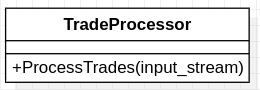

## Một thiết kế không tốt

     
ProcessTrades bao gồm nhiều chức năng,  
<a href="trade_processor.hpp">TradeProcessor</a> đảm nhận nhiều trách nhiệm.

Trong ví dụ này lớp [TradeProcessor](trade_processor.cpp) đảm nhiệm quá nhiều trách nhiệm/có nhiều khả năng thay đổi và đồng lớp thời phương thức ProcessTrades cũng thực hiện quá nhiều chức năng.

Phương thức ProcessTrades đang thực hiện các việc sau:

1. Đọc các dòng từ luồng dữ liệu vào và luwo trong 1 vec-tơ.
2. Đọc các trường từ mỗi dòng và lưu trong 1 đối tượng TradeRecord.
3. Kiểm tra dữ liệu trong quá trình đọc và đưa ra các cảnh báo nếu có.
4. Lưu các đội tượng TradeRecord đọc được vào cơ sở dữ liệu.

Các trách nhiệm của [TradeProcessor](trade_processor.hpp) bao gồm: Đọc dữ liệu từ luồng vào, xử lý chuỗi, kiểm tra trường dữ liệu, lưu dữ liệu lịch sử, và lưu vào CSDL. Theo nguyên lý 1 trách nhiệm, mỗi lớp chỉ nên có 1 lý do để thay đổi. Tuy nhiên với triển khai này [TradeProcessor](trade_processor.hpp) có thể thay đổi trong các trường hợp sau:

+ Thay đổi nguồn dữ liệu vào, ví dụ: Đọc từ 1 tệp JSON.
+ Khi định dạng dữ liệu đầu vào thay đổi, ví dụ: Có thêm 1 trường mới.
+ Khi quy tắc kiểm tra tính đúng đắn thay đổi.
+ Khi cách lưu dữ liệu lịch sử thay đổi, ví dụ: Lưu vào tệp thay vì xuất ra màn hình.
+ Khi cơ sở dữ liệu thay đổi, ví dụ: chuyển đổi từ CSDL quan hệ sang CSDL tài liệu.

Ngoài ra thử tưởng tượng vấn đề quản lý đồng thời nhiều nguồn dữ liệu vào khác nhau, khi hiện nay [TradeProcessor](trade_processor.cpp) không có khả năng đọc dữ liệu từ nhiều nguồn.

Mã nguồn sau khi tái cấu trúc được đặt trong [clear-trade](../clear-trade).
