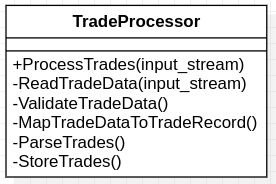

## Thiết kế cơ bản với các phương thức nhỏ

     
Tách các chức năng trong ProcessTrades thành các phương thức

Triển khai này giữ nguyên lô-gic xử lý và các tính năng của [bad-trade](../bad-trade), tuy nhiên mã nguồn được tái cấu trúc lại và các chức năng được đóng gói mạch lạc hơn. Tuy nhiên lớp [TradeProcessor](trade_processor.hpp) vẫn đang đảm nhiệm nhiều trách nhiệm.

Bước tiếp theo là tách các trách nhiệm cuả lớp TradeProcessor bằng cách đóng gói vào các lớp khác nhau và đặt sau các giao diện. Kết quả được đặt trong [flexible-trade](../flexible-trade).