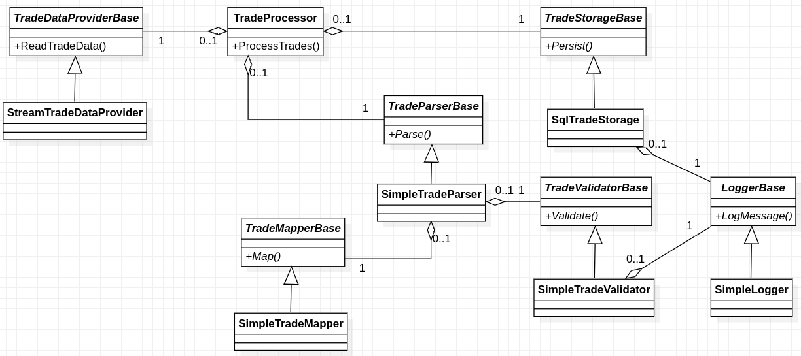

## Áp dụng nguyên lý 1 trách nhiệm

     
Tách các chức năng trong ProcessTrades thành các phương thức

Sử dụng các giao diện giúp cho việc đáp ứng các yêu cầu thay đổi dễ dàng hơn. Với phiên bản này chúng ta có thể xử lý các yêu cầu thay đổi đã được đề cập trong phiên bản [bad-trade](../bad-trade) mà không thay đổi các lớp đã có.

* Yêu cầu: Đọc dữ liệu vào từ 1 dịch vụ Web qua các APIs thay vì sử dụng các luồng như hiện tại.
  + Giải pháp: Tạo 1 lớp mới kế thừa TradeDataProvider để tương tác với dịch vụ Web.
* Yêu cầu: Thay đổi định dạng xuất dữ liệu lịch sử, lưu vào tệp thay vì xuất ra màn hình như hiện tại.
  + Giải pháp: Phát triển thêm 1 lớp kế thừa từ LoggerBase.
* Yêu cầu: Thay đổi định dạng lưu trữ cố định, lưu vào MongoDB
  + Giải pháp: Phát triển thêm 1 lớp kế thừa TradeStorageBase.
* v.v..