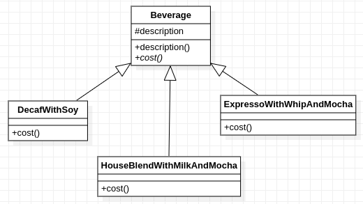

# Một thiết kế không tốt

     
Mỗi tổ hợp thành phần là 1 lớp

Với thiết kế này, đồ uống cụ thể với các thứ thêm vào cụ thể sẽ được biểu diễn bằng 1 lớp riêng kế thừa Beverage rồi sau đó tự thiết lập mô tả trong description và định nghĩa lại cost.

Tuy vẫn có thể mở rộng mà không thay đổi mã nguồn đã có, nhưng sẽ cần rất nhiều lớp cho tất cả các tổ hợp của đồ uống và những cái thêm vào. Bên cạnh đó các lớp đồ uống cũng phụ thuộc vào các thành phần của nó, ví dụ khi giá sữa thay đổi thì phương thức tính giá trong các lớp cũng phải được cập nhật theo.