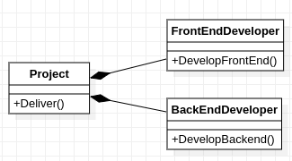

## Một thiết kế có chiều phụ thuộc cần được đảo ngược

      
    Lớp <a href="project.hpp">Project</a> phụ thuộc vào các lớp cụ thể

Project phụ thuộc vào FrontEndDeveloper và BackEndDeveloper là các lớp cụ thể.