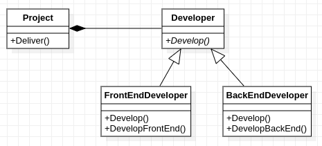

## Thiết kế sau khi đảo ngược phụ thuộc

      
    Các lớp cùng phụ thuộc vào giao diện <a href="developer.hpp">Developer</a>

Sau khi đảo ngược phụ thuộc quan hệ giữa Project và FrontEndDeveloper và BackEndDeveloper được nới lỏng. Các lớp FrontEndDeveloper và BackEndDeveloper bây giờ phụ thuộc vào giao diện Developer (chiều phụ thuộc được đảo ngược).