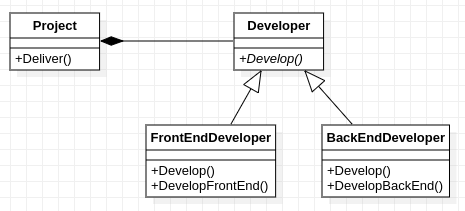

## Thiết kế sau khi đảo chiều phụ thuộc

      

Triển khai này khai thác thế mạnh của C++.

Cùng ý tưởng như [dip-good-inhr](../dip-good-inhr), nhưng triển khai này đã tối ưu hóa hiệu năng bằng cách loại bỏ kế thừa để tránh kích hoạt động dựa trên các bảng ảo, dựa trên khuôn mẫu với danh sách kiểu linh động.
    